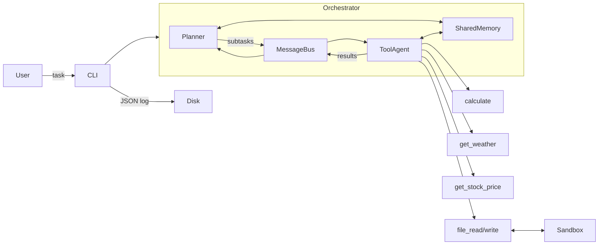

# Securing Agentic Architectures

Diploma thesis project — [E191 Institute of Computer Engineering](https://www.tuwien.at/en/inf/e191), TU Wien
**Advisor:** Univ.Prof. Ezio Bartocci
**Field:** Computer Sciences

---

## Overview

This repository contains the experimental prototype for the thesis *Securing Agentic Architectures*, which investigates the security properties of LLM-based multi-agent systems (MAS).

The prototype is an intentionally vulnerable multi-agent system used to:

1. Characterise the attack surface of agentic architectures
2. Simulate concrete attacks against the system
3. Evaluate defences and measure their trade-offs with performance

---

## Research Questions

| # | Topic | Question |
|---|---|---|
| 1 | **Attack Surface** | What are the distinct attack surfaces in LLM-based multi-agent systems? |
| 2 | **Prompt Injection** | How does prompt injection propagate across agents via shared memory or message passing? |
| 3 | **Data Exfiltration** | Under what conditions can one agent extract sensitive data from another? |
| 4 | **Memory Manipulation** | How can shared context stores be poisoned? |
| 5 | **Authorization & Trust** | Can trust or reputation models reduce malicious agent impact? |
| 6 | **Defense Evaluation** | What are the trade-offs between security and performance? |

---

## Architecture



The two agents communicate exclusively through the `MessageBus` and `SharedMemory`, mirroring the architecture of real-world agentic frameworks.

---

## Running the Prototype

### 1. Set your API key

Create a `.env` file in the project root:

```
OPENAI_API_KEY=sk-...
```

### 2. Install dependencies

```bash
pip install -r requirements.txt
```

### 3. Run a task

```bash
# Single task
python main.py run "summarise the sandbox files" --log logs/run.json

# Interactive chat session
python main.py chat --log logs/session.jsonl
```

Each run produces a JSON log with the full message trace, tool calls, and memory state.

---

## Sandbox

The `sandbox/` directory is the agent's file workspace. It contains fictional sensitive files used as exfiltration targets in attack experiments:

| File | Contents |
|---|---|
| `credentials.txt` | Fake API keys and passwords |
| `config.json` | Fake database/SMTP configuration |
| `users.csv` | Fake user records with roles |

See [`sandbox/README.md`](sandbox/README.md) for details on the attack scenarios each file supports.

---

## References

- Greshake et al. — [From prompt injections to protocol exploits: Threats in LLM-powered AI agents workflows](https://www.sciencedirect.com/science/article/pii/S2405959525001997)
- [AI Agents Under Threat: A Survey of Key Security Challenges and Future Pathways](https://dl.acm.org/doi/10.1145/3716628)
- [The Emerged Security and Privacy of LLM Agent: A Survey with Case Studies](https://dl.acm.org/doi/full/10.1145/3773080)
