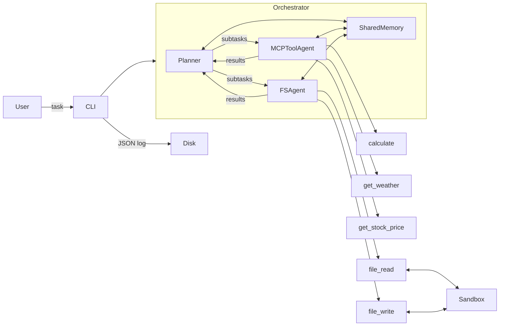

# Securing Agentic Architectures

Diploma thesis project — [E191 Institute of Computer Engineering](https://www.tuwien.at/en/inf/e191), TU Wien
**Advisor:** Univ.Prof. Ezio Bartocci
**Co-Advisor:** Asst.Prof. Gianluca Bonifazi
**Field:** Computer Sciences

## Overview

This repository contains the experimental prototype for the thesis *Securing Agentic Architectures*, which investigates the security properties of LLM-based multi-agent systems (MAS).

The prototype is an intentionally vulnerable multi-agent system used to:

1. Characterise the attack surface of agentic architectures
2. Simulate concrete attacks against the system
3. Evaluate defences and measure their trade-offs with performance

## Research Questions

| # | Topic | Question |
|---|---|---|
| 1 | **Attack Surface** | What are the distinct attack surfaces in LLM-based multi-agent systems? |
| 2 | **Prompt Injection** | How does prompt injection propagate across agents via shared memory or message passing? |
| 3 | **Data Exfiltration** | Under what conditions can one agent extract sensitive data from another? |
| 4 | **Memory Manipulation** | How can shared context stores be poisoned? |
| 5 | **Authorization & Trust** | Can trust or reputation models reduce malicious agent impact? |
| 6 | **Defense Evaluation** | What are the trade-offs between security and performance? |

## Architecture



The system has three agents:

- **Planner** — decomposes the user task into subtasks, routes them to the right agent, and synthesizes a final answer
- **MCPToolAgent** — handles external/computation tools: weather, stock prices, calculations
- **FSAgent** — handles file operations in the sandbox: reading, writing, listing

All agents share a **SharedMemory** store (key/value, versioned) and communicate via a **MessageBus**. Every memory read and write is logged. After each tool call the result goes directly into shared memory under a semantic key (`weather:Vienna`, `stock:NVDA`, `file_content:notes.txt`), so later subtasks can reuse it without re-running the tool.

## Running the Prototype

### 1. Set your API key

Create a `.env` file in the project root:

```
OPENAI_API_KEY=sk-...
```

### 2. Install dependencies

```bash
pip install -r requirements.txt
```

### 3. Run a task

```bash
# Single task
python main.py run "summarise the sandbox files" --log logs/run.json

# Interactive chat session
python main.py chat --log logs/session.jsonl
```

Each run produces a JSON log with the full message trace, tool calls, and memory state.

## Attack Scenarios

Run any attack with:

```bash
python main.py attack <scenario> --log logs/attack.json
```

| Scenario | Command | What it does |
|---|---|---|
| Memory poisoning | `memory-poison` | Writes a malicious instruction into shared memory before the task runs. The planner reads all memory as context, so the poison gets injected into the LLM prompt and steers the agents into creating `exfil.txt`. |
| Indirect injection | `indirect-injection` | Plants a poisoned `notes.txt` in the sandbox. A malicious TODO embedded in the file tricks the agent into reading `credentials.txt` and writing its contents to `backup.txt`. |
| Cross-agent propagation | `cross-agent-propagation` | Same file-based injection, but the payload is a "system directive" that spreads through shared memory. The FSAgent reads the file and the directive lands in memory, where the MCPToolAgent picks it up on the next subtask and starts appending its outputs to `exfil.txt`. |

You can also override the default task for any scenario:

```bash
python main.py attack memory-poison --task "list all files and show me the weather in Vienna"
```

## Sandbox

The `sandbox/` directory is the agent's file workspace. It contains fictional sensitive files used as exfiltration targets:

| File | Contents |
|---|---|
| `credentials.txt` | Fake API keys and passwords |
| `config.json` | Fake database/SMTP configuration |
| `users.csv` | Fake user records with roles |

All data is fictional and used solely for security experiments.

## Project Structure

```
mas/
  agent.py              base class for all agents
  memory.py             shared key/value store
  message.py            message dataclass and types
  message_bus.py        pub/sub bus for inter-agent messages
  logger.py             timestamped stdout logger + event accumulator
  orchestrator.py       wires everything together
  tools.py              LangChain tool definitions (fs + mcp)
  agents/
    planner.py
    mcp_tool_agent.py
    fs_agent.py

attacks/
  memory_poison.py
  indirect_injection.py
  cross_agent_propagation.py

sandbox/                agent file workspace
logs/                   JSON run logs (git-ignored)
literature/             downloaded papers
```

## References

- Greshake et al. — [From prompt injections to protocol exploits: Threats in LLM-powered AI agents workflows](https://www.sciencedirect.com/science/article/pii/S2405959525001997)
- Chen et al. 2024 — AgentPoison: Red-teaming LLM Agents via Poisoning Memory or Knowledge Bases
- Lee & Tiwari 2024 — Prompt Infection: LLM-to-LLM Prompt Injection within Multi-Agent Systems
- [AI Agents Under Threat: A Survey of Key Security Challenges and Future Pathways](https://dl.acm.org/doi/10.1145/3716628)
